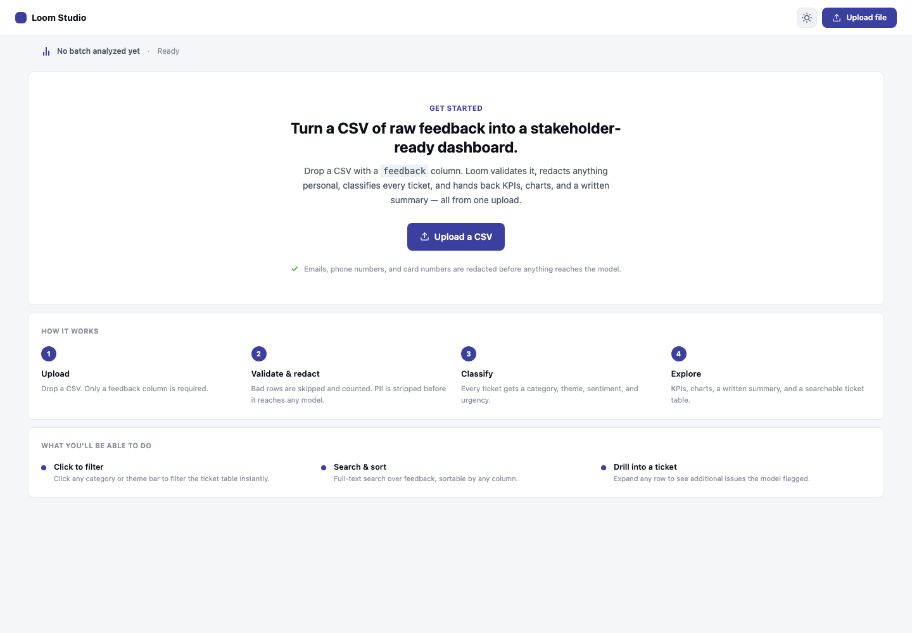
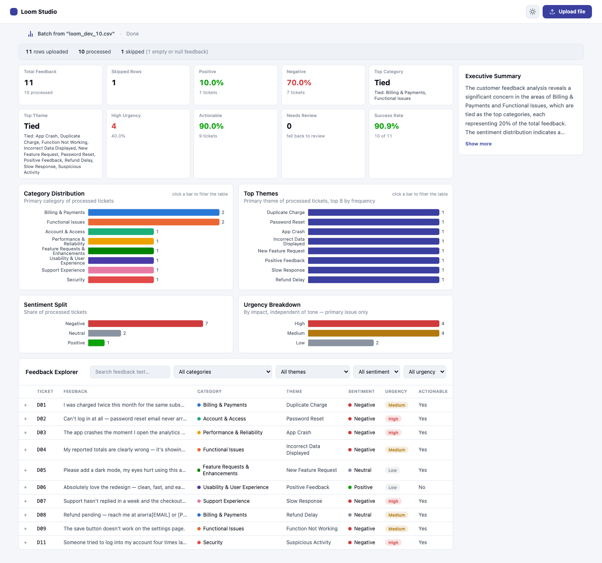
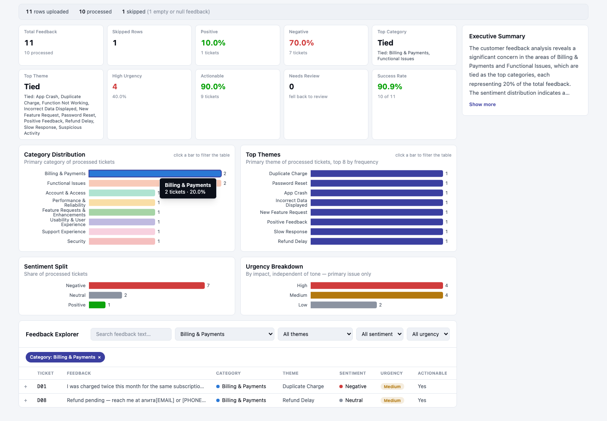
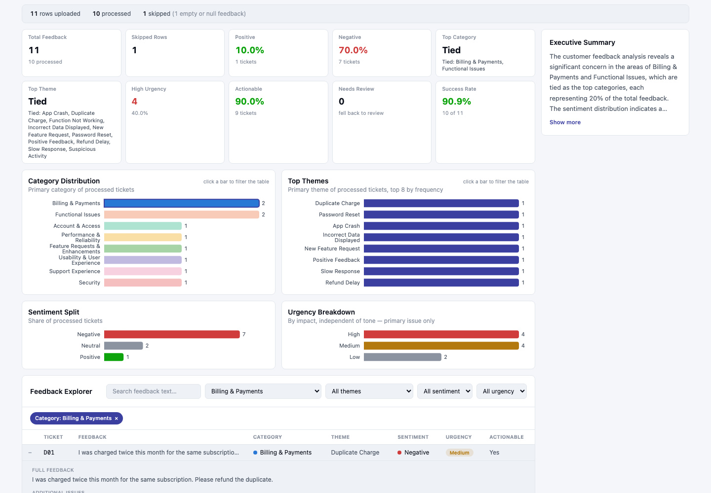

# Loom

**AI-powered customer feedback classification.** Upload a CSV of raw, messy customer feedback. Get back per-ticket classification (category, theme, sentiment, urgency, actionable), deterministic analytics, and a grounded executive summary — rendered as a clean, stakeholder-ready dashboard. One upload, one backend call, no dashboard-side AI.

I built this end to end — backend pipeline, prompt design, and the React frontend — as a demonstration of how to put an LLM inside a real product without letting it become the source of truth for anything that has to be correct. The short version of the design: **the model classifies and writes prose; Python counts.** Every number on the dashboard is deterministic; the only two places an LLM ever runs are per-ticket classification and the closing narrative, and both are validated before anything downstream trusts them.

---

## Table of contents

- [What it looks like](#what-it-looks-like)
- [Why it's built this way](#why-its-built-this-way)
- [Architecture](#architecture)
- [Tech stack](#tech-stack)
- [Quickstart](#quickstart)
- [The API contract](#the-api-contract)
- [Project structure](#project-structure)
- [Testing](#testing)
- [Known limitations](#known-limitations)
- [Repo map / further reading](#repo-map--further-reading)
- [License](#license)

---

## What it looks like

**Before any upload** — the app orients you instead of showing a blank page: a real CTA, the actual processing pipeline shown as steps, and what you'll be able to do once data's in.



**After uploading a CSV** — KPIs, four labeled distribution charts, a grounded executive summary, and a searchable/sortable ticket table, all from one `/analyze` response. (This is a real run against the bundled 11-row dev sample — nothing here is mocked.)



**Click a chart bar to filter the table** — category and theme charts are clickable; the ticket table narrows instantly, with a clearable pill showing the active filter.



**Expand a ticket** to see the full feedback text and any secondary issues the model flagged on a multi-issue ticket.



---

## Why it's built this way

A few decisions that shape everything else in this repo:

- **The LLM classifies and phrases; it never computes.** Category, theme, sentiment, and urgency come from one structured LLM call per ticket. Every count, percentage, and KPI is plain Python over the validated results. The executive summary is a second LLM call, but it's handed Python-computed facts and instructed to narrate them, not invent or recompute anything.
- **Closed vocabularies, enforced by schema, not by prompt wording.** Nine categories, a fixed theme list per category (with one deliberate cross-category exception — see below), three sentiment values, three urgency values. An invented or misspelled value fails Pydantic validation — it doesn't quietly become a tenth category.
- **Never crash the batch.** Every ticket goes through a bounded repair sequence — validate, coerce (free), one guaranteed re-prompt, then a fallback shape — before it's allowed to fail. One malformed ticket, one timeout, one weird input never takes down the other 99. The fallback rate (`fell_back_count`) is surfaced on the dashboard as a quality signal, not hidden as an error.
- **PII never reaches the model.** Emails, phone numbers, card numbers, and ID-length digit runs are redacted by regex before any text is sent to the LLM — not after, not "mostly."
- **The dashboard never calls the LLM.** It renders exactly one backend response. No polling, no second request, no client-side recomputation of anything the backend already computed.
- **Ties are surfaced, not hidden.** If two categories are tied for the top spot, `top_category` is `null` and `category_leaders` lists both — the frontend is built to handle that explicitly rather than silently picking whichever one happened to come first.

If you want the full reasoning behind any of this — including the tradeoffs I made deliberately and documented rather than hid — see [`docs/Loom_Source_of_Truth.md`](docs/Loom_Source_of_Truth.md).

---

## Architecture

```text
                         +----------------------+
                         |   React Dashboard    |
                         +----------+-----------+
                                    |
                               REST API (POST /analyze, one call)
                                    |
                    +---------------v---------------+
                    |        FastAPI Backend        |
                    +---------------+---------------+
                                    |
     +------------------+-----------+-----------+------------------+
     |                  |                       |                  |
     v                  v                       v                  v
+-----------+   +----------------+     +----------------+   +-------------+
| Validation|-->| Preprocessing  |---->|  AI Pipeline   |-->| Analytics   |
| Layer     |   | (clean + PII)  |     | (batch LLM)    |   | Engine      |
+-----------+   +----------------+     +-------+--------+   +------+------+
                                               |                   |
                                               +---------+---------+
                                                         |
                                                  Structured JSON
                                                         |
                                              Executive Summary (LLM)
                                                         |
                                                 Dashboard Response
```

The whole pipeline runs inside one stateless request. There's no database, no job queue, no `upload_id` — you send a CSV, you get back a complete JSON payload, and the frontend renders it.

### The pipeline, stage by stage

1. **Validate** — reject the whole upload on a structural problem (missing `feedback` column, empty file); skip and count individual bad rows (empty feedback) without failing the run.
2. **Normalize** — strip HTML, clean Markdown, normalize unicode/whitespace.
3. **Redact PII** — regex-based, before any text reaches the model. `[EMAIL]`, `[PHONE]`, `[CARD]`, `[ID]` placeholders preserve context without preserving the actual value.
4. **Long-ticket routing** — anything over 300 words gets summarized (preserving every distinct issue, never collapsing to one topic) before classification, so the classification prompt stays focused.
5. **Classify** — one LLM call per ticket, temperature 0, all tickets in a single concurrency-bounded worker pool (no batch-boundary stalls). Validate → coerce → one guaranteed re-prompt → fallback.
6. **Aggregate** — pure Python: distributions, KPIs, tie detection, percentages (against processed tickets, never total uploaded — except processing success rate, which is the one metric that's supposed to divide by total).
7. **Summarize** — Python assembles the facts; one LLM call narrates them into a short executive summary, grounded so it can't invent or contradict a number.

---

## Tech stack

| Layer | Technology | Why |
|---|---|---|
| Backend | Python 3.12, FastAPI | Async, typed, automatic OpenAPI docs |
| Validation | Pydantic v2 | Schema enforcement *is* the closed-vocabulary guarantee |
| Data handling | Pandas | CSV parsing |
| AI | OpenAI (`gpt-4o-mini` by default) | Structured output via forced function-calling — no free-text parsing |
| Frontend | React 19 + TypeScript, Vite | Modular, type-safe UI, fast dev loop |
| Styling | Tailwind CSS v4 | Design tokens as CSS custom properties → light/dark theming with no per-component variants |
| Charts | Recharts | Declarative, accessible, labeled by default |
| Backend tests | pytest | 48 tests, no real LLM calls needed to run them |
| Frontend tests | Vitest + Testing Library + jsdom | Real component interactions against payloads captured from the live backend |

---

## Quickstart

You'll run two processes: the FastAPI backend and the Vite frontend dev server. Full detail (troubleshooting, every config option, exact test coverage) lives in each project's own README — this is the fast path to seeing it work.

### 1. Backend

```bash
cd backend
python3 -m venv .venv
source .venv/bin/activate          # Windows: .venv\Scripts\activate
pip install -r requirements.txt
cp .env.example .env
```

Open `.env` and set the two required values:

```
LLM_MODEL=gpt-4o-mini
API_KEY=sk-...your-real-OpenAI-key...
```

Then start it:

```bash
uvicorn main:app --reload --port 8000
```

Verify it's alive: open `http://127.0.0.1:8000/docs` (Swagger UI), or run the bundled CLI over a sample dataset:

```bash
python3 cli.py data/loom_dev_10.csv
```

→ Full detail: [`backend/README.md`](backend/README.md)

### 2. Frontend

In a second terminal:

```bash
cd frontend
npm install
cp .env.example .env   # already points at http://127.0.0.1:8000 by default
npm run dev
```

Open the printed URL (default `http://localhost:5173`). Upload a CSV with a `feedback` column — `backend/data/loom_dev_10.csv` is a good first try, it's exactly what generated the screenshots above.

→ Full detail: [`frontend/README.md`](frontend/README.md)

### That's it

If both are running and you can upload `backend/data/loom_dev_10.csv` and see a populated dashboard, everything is correctly wired. If something doesn't work, both READMEs have a Troubleshooting table — check there before assuming it's a bug.

---

## The API contract

Exactly one endpoint. Request: multipart CSV. Response:

```json
{
  "validation_report": {
    "total_rows": 11,
    "processed": 10,
    "skipped": 1,
    "skip_reasons": { "empty_or_null_feedback": 1 },
    "fell_back_count": 0
  },
  "items": [
    {
      "ticket_id": "D01",
      "feedback_text": "I was charged twice this month for the same subscription. Please refund the duplicate.",
      "was_summarized": false,
      "primary_category": "Billing & Payments",
      "primary_theme": "Duplicate Charge",
      "sentiment": "Negative",
      "sentiment_score": -0.7,
      "urgency": "Medium",
      "actionable": true,
      "additional_issues": []
    }
  ],
  "analytics": {
    "category_distribution": { "Billing & Payments": 2, "Functional Issues": 2, "...": "6 more" },
    "top_category": null,
    "category_leaders": ["Billing & Payments", "Functional Issues"],
    "high_urgency_count": 4,
    "actionable_pct": 90.0,
    "processing_success_rate": 90.9
  },
  "summary": "The customer feedback analysis reveals a significant concern in the areas of Billing & Payments and Functional Issues..."
}
```

A few things worth knowing before you consume this response:

- **`top_category`/`top_theme` are `null` on a tie.** Check `category_leaders`/`theme_leaders` instead of assuming a single winner — the frontend does exactly this (see the KPI cards in the dashboard screenshot above, where both are shown as "Tied").
- **Skipped rows never enter any percentage or distribution.** They're reported once, in `validation_report`, and nowhere else.
- **`additional_issues`** holds secondary issues on multi-issue tickets — never counted in headline distributions, only shown when you expand a ticket.
- **File-level rejections are `4001`/`4002`/`4003`** (missing `feedback` column / empty file / no usable rows). Every other failure — a bad model response, a timeout — resolves internally to a fallback classification; the endpoint still returns `200`, with `fell_back_count` telling you how many tickets needed it.

Full schema, every field, and the reasoning behind each rule: [`backend/README.md`](backend/README.md#response-shape).

---

## Project structure

```text
Loom-AI-Powered-Customer-Feedback/
├── backend/            FastAPI service — validation, PII redaction, classification,
│                       analytics, executive summary. See backend/README.md.
├── frontend/           React + TypeScript dashboard — one POST /analyze call,
│                       renders everything from the response. See frontend/README.md.
├── docs/
│   ├── Loom_Source_of_Truth.md   Full design rationale — the document that wins
│   │                             if anything else (including this README) disagrees
│   └── screenshots/               The images embedded above
└── LICENSE             MIT
```

Each service's own README is the maintained source of truth for its file-level structure — `backend/README.md` and `frontend/README.md` both include a full annotated directory tree kept in sync with the actual code.

---

## Testing

Both halves have a real, currently-passing test suite — not aspirational, not skipped, checked as part of building this.

**Backend** — `cd backend && pytest` → 48 tests, zero real LLM calls (a duck-typed `FakeLLMClient` stands in wherever classification/summarization would otherwise fire). Covers file/row validation, PII redaction boundaries, the theme-category and sentiment-score schema validators, the analytics tie contract, the full validate → coerce → re-prompt → fallback repair sequence, and the `/analyze` endpoint end to end.

**Frontend** — `cd frontend && npm test` → Vitest + Testing Library, driving real interactions (upload, search, sort, filter, expand a row, **click an actual rendered chart bar and confirm the table narrows**) against `/analyze` payloads captured verbatim from the live backend, not hand-guessed mocks.

Neither suite is exhaustive by design — a handful of tests per concern, chosen to cover the scenarios that are actually load-bearing (the repair sequence, the tie contract, the denominator rule), not every conceivable input. See each README's Testing section for the full breakdown of what's covered and why.

---

## Known limitations

Documented honestly rather than hidden — full detail in [`backend/README.md`](backend/README.md#known-limitations) and [`docs/Loom_Source_of_Truth.md`](docs/Loom_Source_of_Truth.md):

- Dense multi-issue tickets (3+ distinct problems in one message) have inherent primary-issue ambiguity — the model picks one, reasonably, but not by a formula I can fully specify.
- The `[ID]` PII redaction heuristic is a 5–6 digit-length pattern, not true ID-format matching — it can false-positive on an incidental number that happens to be 5–6 digits.
- `New Feature Request` vs. `Enhancement Request` is a genuinely fuzzy boundary on some tickets, left unresolved rather than force-forwarded to a fake bright line.
- No auth, no database, no persistence — by design for this scope, not an oversight. CORS is currently permissive (`*`) for local/demo use; lock it down before any real deployment.
- **No API rate limiting** — `/analyze` has no per-client throttle. `MAX_CONCURRENCY` bounds in-flight LLM calls *within* one request, but nothing bounds how many requests can run at once. Fine for local/demo use; add rate limiting before any public or multi-tenant deployment, both to protect cost and to stay under the LLM provider's quota. Tracked as future scope in [`docs/Loom_Source_of_Truth.md`](docs/Loom_Source_of_Truth.md).

---

## Repo map / further reading

| Document | What's in it |
|---|---|
| [`backend/README.md`](backend/README.md) | Backend setup, running (CLI + API), full response shape, configuration, error codes, testing, troubleshooting |
| [`frontend/README.md`](frontend/README.md) | Frontend setup, running, build/test/lint (including *why* the test suite stubs several browser APIs), full component structure, troubleshooting |
| [`docs/Loom_Source_of_Truth.md`](docs/Loom_Source_of_Truth.md) | The authoritative design document — architecture, taxonomy, every pipeline stage, the validation/repair contract, in full detail |

---

## License

MIT — see [`LICENSE`](LICENSE).
