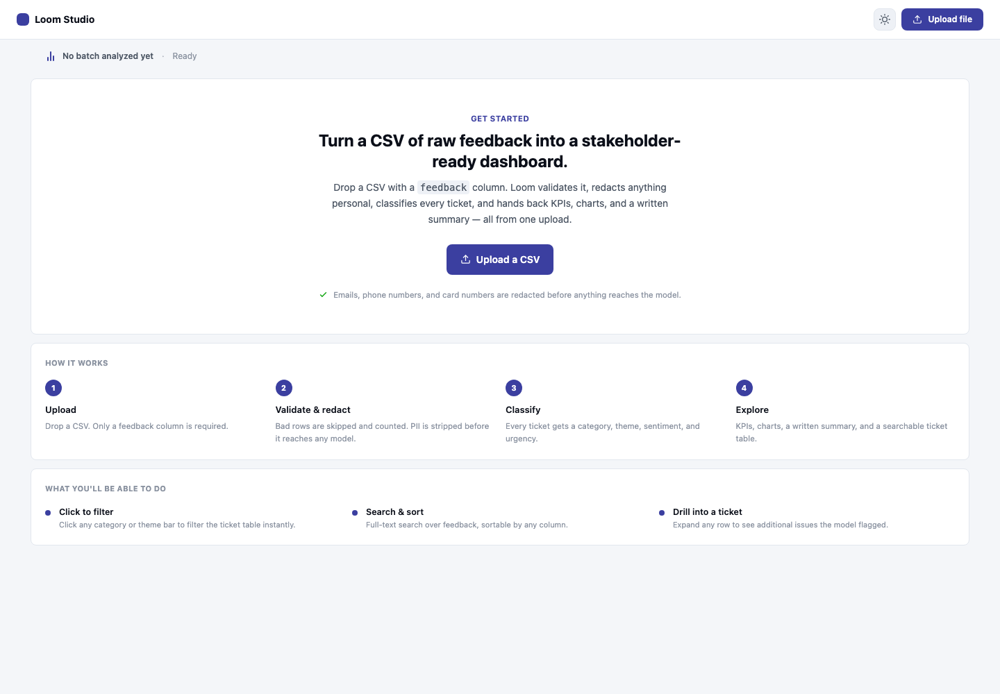
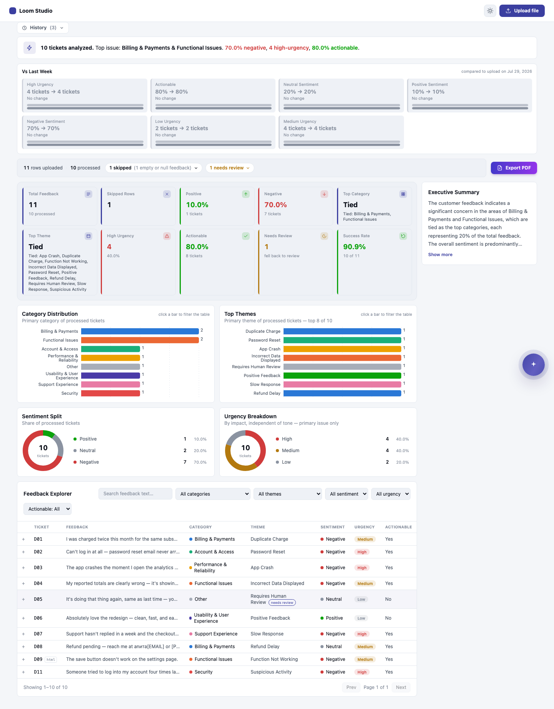
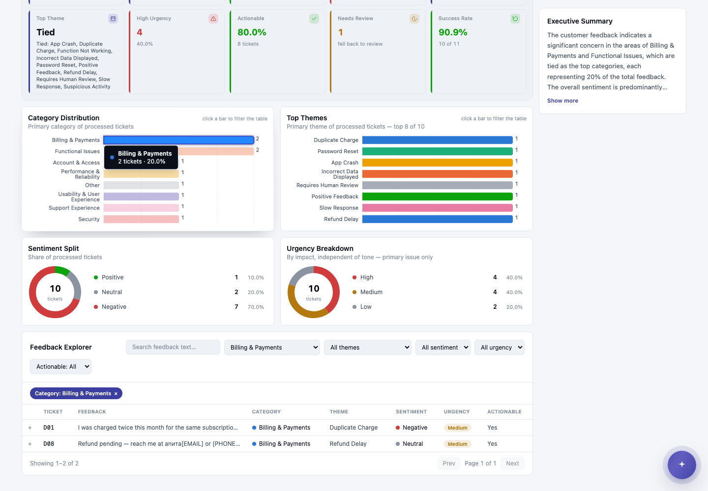
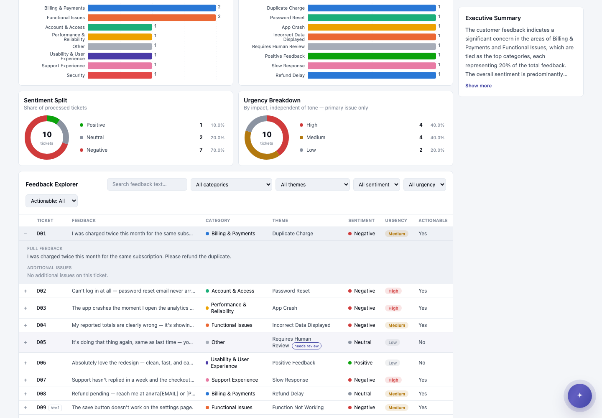
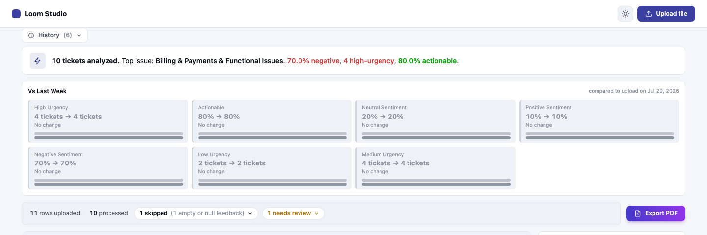
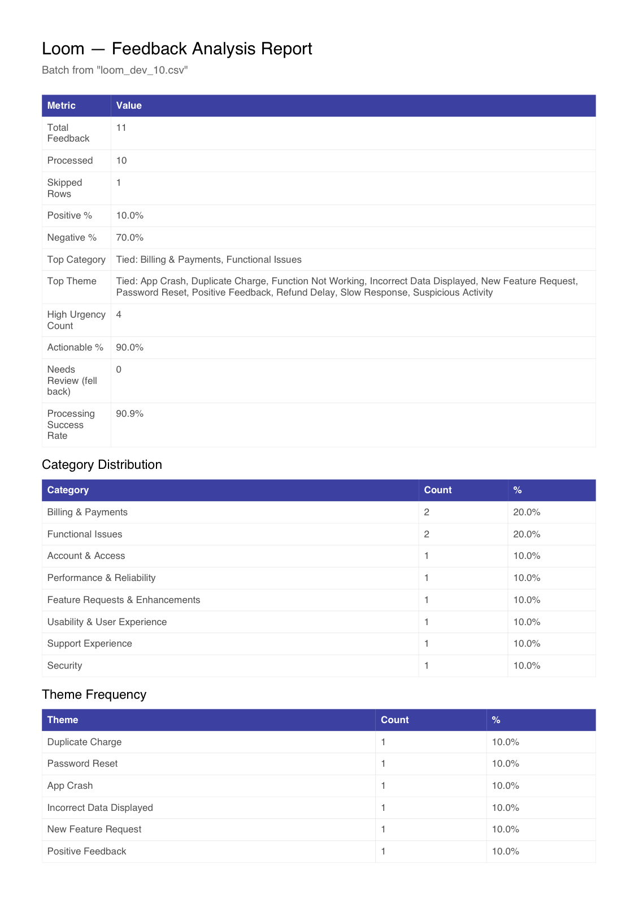
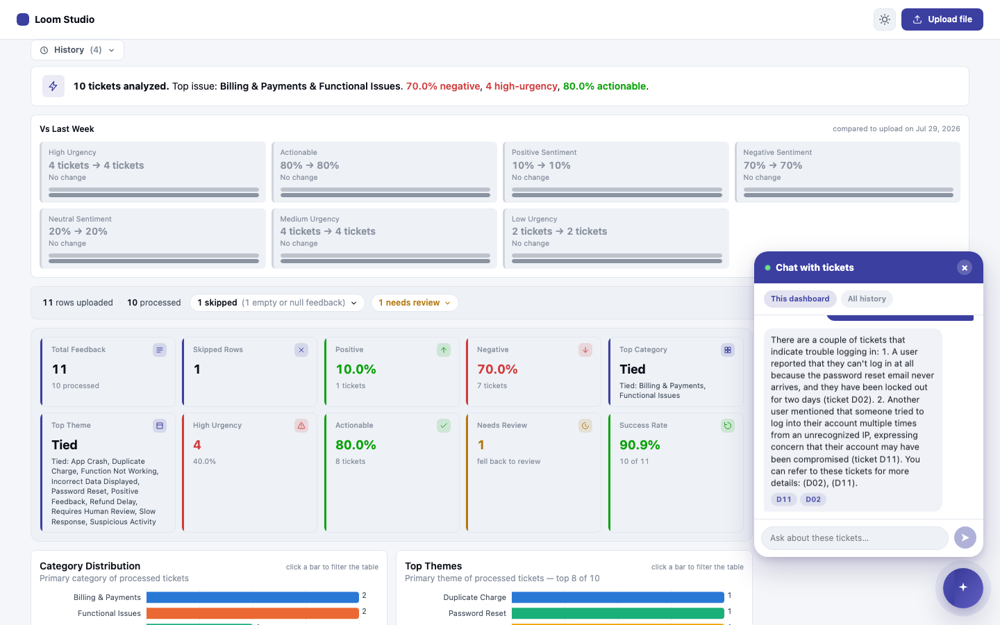

# Loom

**AI-powered customer feedback classification.** Upload a CSV of raw, messy customer feedback. Get back per-ticket classification (category, theme, sentiment, urgency, actionable), deterministic analytics, and a grounded executive summary — rendered as a clean, stakeholder-ready dashboard. One upload, one backend call, no dashboard-side AI.

I built this end to end — backend pipeline, prompt design, and the React frontend — as a demonstration of how to put an LLM inside a real product without letting it become the source of truth for anything that has to be correct. The short version of the design: **the model classifies and writes prose; Python counts.** Every number on the dashboard is deterministic; the only two places an LLM ever runs are per-ticket classification and the closing narrative, and both are validated before anything downstream trusts them.

---

## Table of contents

- [What it looks like](#what-it-looks-like)
- [Why it's built this way](#why-its-built-this-way)
- [Architecture](#architecture)
- [Tech stack](#tech-stack)
- [Quickstart](#quickstart)
- [The API contract](#the-api-contract)
- [Project structure](#project-structure)
- [Testing](#testing)
- [Known limitations](#known-limitations)
- [Repo map / further reading](#repo-map--further-reading)
- [License](#license)

---

## What it looks like

**Before any upload** — the app orients you instead of showing a blank page: a real CTA, the actual processing pipeline shown as steps, and what you'll be able to do once data's in. The whole hero card is a real drop target (not just the "Upload a CSV" button) — dragging a file over it shows a dashed highlight and "Drop to analyze."



**While it's processing, the progress bar is real** — `/analyze` streams NDJSON, a line each time a ticket actually finishes classification, so "Classifying tickets… 6/10" and the fill percentage reflect genuine backend progress, not a timer guessing how long this usually takes.

**After uploading a CSV** — a one-line headline strip leads with the conclusion (tickets analyzed, top issue, % negative, high-urgency count, % actionable), then KPIs, four labeled distribution charts, a grounded executive summary, and a searchable/sortable, paginated (15/page) ticket table, all from one `/analyze` response. (This is a real run against the bundled 11-row dev sample — nothing here is mocked.)



**Skipped rows and tickets that needed human review are never just a count.** Both are labeled, bordered toggle chips next to the validation summary — clicking one expands the real row list (ticket ID + reason for skipped rows, ticket ID + feedback text for fallback/review tickets), not just a number with no way to see which ticket it refers to.

**Click a chart bar — or a KPI card — to filter the table.** Category/theme charts and the Positive, Negative, Top Category, Top Theme, High Urgency, Actionable, and Needs Review KPI cards are all click-to-filter; the ticket table narrows instantly, the active card gets a colored ring, and a clearable pill shows the active filter. Bars are also keyboard-accessible (Tab + Enter/Space), not mouse-only.



**Expand a ticket** to see the full feedback text and any secondary issues the model flagged on a multi-issue ticket.



**Export a PDF report** — one click, built client-side from the same payload already on screen: KPIs, the four distributions, the skipped-rows and needs-review lists, and the executive summary. Deliberately not a raw ticket dump — that's already searchable in the table above.





**Every upload is remembered.** Each `/analyze` call now persists its result to Postgres. A "History (N)" toggle — collapsed by default, never shown on the idle landing screen — expands into a list of every past upload by filename and timestamp; clicking one replays that week's own dashboard read-only, including its own ticket table. The live dashboard also gets an automatic **"Vs Previous Upload"** section: before → after values (never a bare delta), colored by whether the change is actually good or bad news for that specific metric — a dropping High Urgency count is green, not red, just because the number went down. The executive summary narrates this shift too ("negative sentiment fell from 70% to 33%"), grounded in the same computed numbers, never invented.

**Ask questions about the tickets, in plain English.** A gradient orb sits fixed bottom-right of the dashboard — gently pulsing while idle, morphing into a chat panel (not fading in) when clicked. Ask "who's having trouble logging in?" or "what changed since last week?" scoped to the current upload or every upload so far. Answers are grounded two ways, never guessed: aggregate/statistical questions ("top category", "what changed") are answered only from the same Python-computed facts the executive summary narrates from; content questions ("who complained about X") are answered only from tickets a real `pgvector` similarity search actually retrieved, cited inline — and only the tickets the answer actually cites show up as sources, never everything retrieval happened to surface.



---

## Why it's built this way

A few decisions that shape everything else in this repo:

- **The LLM classifies and phrases; it never computes.** Category, theme, sentiment, and urgency come from one structured LLM call per ticket. Every count, percentage, and KPI is plain Python over the validated results. The executive summary is a second LLM call, but it's handed Python-computed facts and instructed to narrate them, not invent or recompute anything.
- **Closed vocabularies, enforced by schema, not by prompt wording.** Nine categories, a fixed theme list per category (with one deliberate cross-category exception — see below), three sentiment values, three urgency values. An invented or misspelled value fails Pydantic validation — it doesn't quietly become a tenth category.
- **Never crash the batch.** Every ticket goes through a bounded repair sequence — validate, coerce (free), one guaranteed re-prompt, then a fallback shape — before it's allowed to fail. One malformed ticket, one timeout, one weird input never takes down the other 99. The fallback rate (`fell_back_count`) is surfaced on the dashboard as a quality signal, not hidden as an error.
- **PII never reaches the model.** Emails, phone numbers, card numbers, and ID-length digit runs are redacted by regex before any text is sent to the LLM — not after, not "mostly."
- **The dashboard never calls the LLM.** It renders exactly one backend response. No polling, no second request, no client-side recomputation of anything the backend already computed.
- **Ties are surfaced, not hidden.** If two categories are tied for the top spot, `top_category` is `null` and `category_leaders` lists both — the frontend is built to handle that explicitly rather than silently picking whichever one happened to come first.
- **Chat never guesses either.** The "Chat with Tickets" widget answers aggregate questions ("top category", "what changed since last week") only from the same computed facts the dashboard already shows, and content questions only from tickets a real vector search actually retrieved — never letting a handful of similarity-matched tickets stand in for a real count, and never citing a ticket that contradicts the question it's supposedly answering.

If you want the full reasoning behind any of this — including the tradeoffs I made deliberately and documented rather than hid — see [`docs/Loom_Source_of_Truth.md`](docs/Loom_Source_of_Truth.md).

---

## Architecture

```text
                         +----------------------+
                         |   React Dashboard    |
                         |  (+ History Sidebar) |
                         +----------+-----------+
                                    |
                               REST API (POST /analyze, one call)
                                    |
                    +---------------v---------------+
                    |        FastAPI Backend        |
                    +---------------+---------------+
                                    |
     +------------------+-----------+-----------+------------------+
     |                  |                       |                  |
     v                  v                       v                  v
+-----------+   +----------------+     +----------------+   +-------------+
| Validation|-->| Preprocessing  |---->|  AI Pipeline   |-->| Analytics   |
| Layer     |   | (clean + PII)  |     | (batch LLM)    |   | Engine      |
+-----------+   +----------------+     +-------+--------+   +------+------+
                                               |                   |
                                               +---------+---------+
                                                         |
                                                  Structured JSON
                                                         |
                                              Executive Summary (LLM)
                                                         |
                                                 Dashboard Response
                                                         |
                                                         v
                                            +------------------------+
                                            |  Postgres (storage/)   |
                                            |  analysis_snapshots    |
                                            |  ticket_items          |
                                            |  (+ pgvector embedding)|
                                            +-----------+------------+
                                                         ^
                                                         |
                                            +------------+-----------+
                                            |      POST /chat        |
                                            | embed Q -> pgvector    |
                                            | search + real facts    |
                                            | -> one grounded reply  |
                                            +------------------------+
                                                         ^
                                                         |
                                              "Chat with Tickets"
                                               widget (Morphing Orb)
```

The classification pipeline itself still runs inside one request — you send a CSV, the response streams real per-ticket progress as classification runs, and the final line carries the complete payload the frontend renders from. What's new: that same call now also persists its result to Postgres on the way out (embedding each ticket's text into a real `pgvector` column along with it), and small read/delete/query endpoints (`GET /uploads`, `GET /uploads/{id}`, `DELETE /uploads/{id}`, `POST /chat`) exist to browse that history and query it — there's still no `upload_id` you pass *in* to `/analyze`.

### The pipeline, stage by stage

1. **Validate** — reject the whole upload on a structural problem (missing `feedback` column, empty file); skip and count individual bad rows (empty feedback) without failing the run.
2. **Normalize** — strip HTML, clean Markdown, normalize unicode/whitespace.
3. **Redact PII** — regex-based, before any text reaches the model. `[EMAIL]`, `[PHONE]`, `[CARD]`, `[ID]` placeholders preserve context without preserving the actual value.
4. **Long-ticket routing** — anything over 300 words gets summarized (preserving every distinct issue, never collapsing to one topic) before classification, so the classification prompt stays focused.
5. **Classify** — one LLM call per ticket, temperature 0, all tickets in a single concurrency-bounded worker pool (no batch-boundary stalls). Validate → coerce → one guaranteed re-prompt → fallback.
6. **Aggregate** — pure Python: distributions, KPIs, tie detection, percentages (against processed tickets, never total uploaded — except processing success rate, which is the one metric that's supposed to divide by total).
7. **Summarize** — Python assembles the facts; one LLM call narrates them into a short executive summary, grounded so it can't invent or contradict a number.

---

## Tech stack

| Layer | Technology | Why |
|---|---|---|
| Backend | Python 3.12, FastAPI | Async, typed, automatic OpenAPI docs |
| Validation | Pydantic v2 | Schema enforcement *is* the closed-vocabulary guarantee |
| Data handling | Pandas | CSV parsing |
| Persistence | Postgres (`psycopg` v3) + `pgvector` | Multi-week history — snapshots + per-ticket items, each embedded into a real `pgvector` column for RAG chat retrieval |
| AI | OpenAI (`gpt-4o-mini` + `text-embedding-3-small` by default) | Structured output via forced function-calling for classification/chat — no free-text parsing; embeddings for chat retrieval |
| Frontend | React 19 + TypeScript, Vite | Modular, type-safe UI, fast dev loop |
| Styling | Tailwind CSS v4 | Design tokens as CSS custom properties → light/dark theming with no per-component variants |
| Charts | Recharts | Declarative, accessible, labeled by default |
| Export | jsPDF + jspdf-autotable | Client-side PDF report generation — no server round-trip |
| Backend tests | pytest | 80 tests, no real LLM calls needed to run them |
| Frontend tests | Vitest + Testing Library + jsdom | Real component interactions against payloads captured from the live backend |

---

## Quickstart

You'll run two processes: the FastAPI backend and the Vite frontend dev server. Full detail (troubleshooting, every config option, exact test coverage) lives in each project's own README — this is the fast path to seeing it work.

### 1. Backend

```bash
cd backend
python3 -m venv .venv
source .venv/bin/activate          # Windows: .venv\Scripts\activate
pip install -r requirements.txt
```

Postgres + `pgvector` is required (multi-week history and the chat feature both need it):

```bash
brew install postgresql@16 pgvector
brew services start postgresql@16
createdb loom_dev
```

If `pgvector` fails to load at startup (`CREATE EXTENSION vector` error), Homebrew's bottle didn't match your Postgres version — see [`backend/README.md`](backend/README.md#requirements) for the one-time build-from-source fix (no data loss, no Postgres upgrade needed).

```bash
cp .env.example .env
```

Open `.env` and set the two required values:

```
LLM_MODEL=gpt-4o-mini
API_KEY=sk-...your-real-OpenAI-key...
```

Then start it:

```bash
uvicorn main:app --reload --port 8000
```

Verify it's alive: open `http://127.0.0.1:8000/docs` (Swagger UI), or run the bundled CLI over a sample dataset:

```bash
python3 cli.py data/loom_dev_10.csv
```

→ Full detail: [`backend/README.md`](backend/README.md)

### 2. Frontend

In a second terminal:

```bash
cd frontend
npm install
cp .env.example .env   # already points at http://127.0.0.1:8000 by default
npm run dev
```

Open the printed URL (default `http://localhost:5173`). Upload a CSV with a `feedback` column — `backend/data/loom_dev_10.csv` is a good first try, it's exactly what generated the screenshots above.

→ Full detail: [`frontend/README.md`](frontend/README.md)

### That's it

If both are running and you can upload `backend/data/loom_dev_10.csv` and see a populated dashboard, everything is correctly wired. If something doesn't work, both READMEs have a Troubleshooting table — check there before assuming it's a bug.

---

## The API contract

The core analysis is still one endpoint. Request: multipart CSV. Response: streamed as newline-delimited JSON (NDJSON) — a progress line each time a ticket finishes classification, one "summarizing" line, then a final line carrying the payload below. Still one request, one response, no polling:

```json
{"type": "progress", "stage": "classifying", "done": 3, "total": 10}
{"type": "progress", "stage": "summarizing", "done": 10, "total": 10}
{"type": "result", "data": { /* payload below */ }}
```

`data`:

```json
{
  "validation_report": {
    "total_rows": 11,
    "processed": 10,
    "skipped": 1,
    "skip_reasons": { "empty_or_null_feedback": 1 },
    "skipped_rows": [{ "ticket_id": "D11", "reason": "empty_or_null_feedback" }],
    "fell_back_count": 0
  },
  "items": [
    {
      "ticket_id": "D01",
      "feedback_text": "I was charged twice this month for the same subscription. Please refund the duplicate.",
      "was_summarized": false,
      "primary_category": "Billing & Payments",
      "primary_theme": "Duplicate Charge",
      "sentiment": "Negative",
      "sentiment_score": -0.7,
      "urgency": "Medium",
      "actionable": true,
      "additional_issues": [],
      "warnings": []
    }
  ],
  "analytics": {
    "category_distribution": { "Billing & Payments": 2, "Functional Issues": 2, "...": "6 more" },
    "top_category": null,
    "category_leaders": ["Billing & Payments", "Functional Issues"],
    "high_urgency_count": 4,
    "actionable_pct": 90.0,
    "processing_success_rate": 90.9
  },
  "summary": "The customer feedback analysis reveals a significant concern in the areas of Billing & Payments and Functional Issues...",
  "upload_id": 42,
  "uploaded_at": "2026-07-28T12:16:55.545472+05:30",
  "comparison": null
}
```

A few things worth knowing before you consume this response:

- **`top_category`/`top_theme` are `null` on a tie.** Check `category_leaders`/`theme_leaders` instead of assuming a single winner — the frontend does exactly this (see the KPI cards in the dashboard screenshot above, where both are shown as "Tied").
- **Skipped rows never enter any percentage or distribution.** They're reported once, in `validation_report`, and nowhere else.
- **`additional_issues`** holds secondary issues on multi-issue tickets — never counted in headline distributions, only shown when you expand a ticket.
- **`validation_report.skipped_rows`** and each item's **`warnings`** (`html_present`, `markdown_present`, `duplicate_feedback`, `long_ticket`) exist so the dashboard can show *which* row was dropped or flagged, not just an aggregate count — never derived by the model, attached from `pipeline/validate.py`'s row-level checks.
- **File-level rejections are `4001`/`4002`/`4003`** (missing `feedback` column / empty file / no usable rows). Every other failure — a bad model response, a timeout — resolves internally to a fallback classification; the endpoint still returns `200`, with `fell_back_count` telling you how many tickets needed it.
- **`upload_id`/`uploaded_at`/`comparison` are new.** `upload_id` is the row this got saved as (`GET /uploads/{upload_id}` replays it later). `comparison` is `null` only on the very first upload ever — otherwise it's the week-over-week diff against whatever was previously most recent, with before/after values for every metric, not just a bare delta. Full shape in [`backend/README.md`](backend/README.md#response-shape).

### History endpoints

`GET /uploads` lists every past upload (id, timestamp, filename), newest first. `GET /uploads/{id}` replays one past upload's full dashboard read-only — same shape as above, including its own `items` and its own `comparison` exactly as it was computed at the time (not recomputed against today's latest). `DELETE /uploads/{id}` permanently deletes it (204) and cascades to its stored tickets.

### Chat endpoint

`POST /chat` — `{ "question": "...", "scope": "dashboard" | "all", "snapshot_id": 42 }` → `{ "answer": "...", "sources": [{ "ticket_id": "1", "snapshot_id": 42, "source_filename": "week3.csv", "similarity": 0.49 }] }`. Two data sources, never blended: aggregate/statistical/comparison questions ("top category", "what changed since last week") are answered only from the same Python-computed facts the executive summary narrates from; content questions ("who complained about X") are answered only from tickets a real `pgvector` cosine-similarity search retrieved, cited inline. `sources` reflects only what the answer actually cited, never everything retrieval surfaced.

Full schema, every field, and the reasoning behind each rule: [`backend/README.md`](backend/README.md#response-shape) (analyze/uploads) and [`backend/README.md`](backend/README.md#chat-endpoint) (chat).

---

## Project structure

```text
Loom-AI-Powered-Customer-Feedback/
├── backend/            FastAPI service — validation, PII redaction, classification,
│                       analytics, executive summary, Postgres persistence (storage/).
│                       See backend/README.md.
├── frontend/           React + TypeScript dashboard — one POST /analyze call,
│                       renders everything from the response, plus a history sidebar
│                       reading GET /uploads. See frontend/README.md.
├── docs/
│   ├── Loom_Source_of_Truth.md   Full design rationale — the document that wins
│   │                             if anything else (including this README) disagrees
│   └── screenshots/               The images embedded above
└── LICENSE             MIT
```

Each service's own README is the maintained source of truth for its file-level structure — `backend/README.md` and `frontend/README.md` both include a full annotated directory tree kept in sync with the actual code.

---

## Testing

Both halves have a real, currently-passing test suite — not aspirational, not skipped, checked as part of building this.

**Backend** — `cd backend && pytest` → 80 tests, zero real LLM calls (a duck-typed `FakeLLMClient` stands in wherever classification/summarization/chat/embeddings would otherwise fire; a real local Postgres + `pgvector` backs the persistence and chat-retrieval tests, isolated to a separate `loom_test` database, truncated between tests). Covers file/row validation, PII redaction boundaries (including the parenthesized-phone-number regex fix), the theme-category and sentiment-score schema validators, the analytics tie contract, the full validate → coerce → re-prompt → fallback repair sequence, the LLM client's retry/backoff/auth-no-retry behavior (including the embeddings call), the executive summary's deterministic fallback path, row-level `warnings` reaching the item, that real per-ticket progress events stream before the result, the week-over-week comparison (before/after values, persisted-not-recomputed on replay), delete-with-cascade, the `/chat` endpoint (both scopes, the similarity floor, citation-based `sources` filtering, facts inclusion for both scopes), and the `/analyze` + `/uploads` endpoints end to end.

**Frontend** — `cd frontend && npm test` → 33 tests, Vitest + Testing Library, driving real interactions (upload, search, sort, filter, expand a row, **click an actual rendered chart bar and confirm the table narrows**, expand the history sidebar, delete-confirm Yes/No, open the chat widget and send a question with the right scope/snapshot id, verify cited sources render) against `/analyze` payloads captured verbatim from the live backend, not hand-guessed mocks.

Neither suite is exhaustive by design — a handful of tests per concern, chosen to cover the scenarios that are actually load-bearing (the repair sequence, the tie contract, the denominator rule), not every conceivable input. See each README's Testing section for the full breakdown of what's covered and why.

---

## Known limitations

Documented honestly rather than hidden — full detail in [`backend/README.md`](backend/README.md#known-limitations) and [`docs/Loom_Source_of_Truth.md`](docs/Loom_Source_of_Truth.md):

- Dense multi-issue tickets (3+ distinct problems in one message) have inherent primary-issue ambiguity — the model picks one, reasonably, but not by a formula I can fully specify.
- The `[ID]` PII redaction heuristic is a 5–6 digit-length pattern, not true ID-format matching — it can false-positive on an incidental number that happens to be 5–6 digits; a 7-12 digit non-phone identifier (e.g. an invoice number) is similarly mislabeled `[PHONE]`.
- `New Feature Request` vs. `Enhancement Request` is a genuinely fuzzy boundary on some tickets, left unresolved rather than force-forwarded to a fake bright line.
- No auth — by design for this scope, not an oversight. `DELETE /uploads/{id}` in particular has no ownership check; fine for a local single-user tool, not fine if this port is ever exposed publicly. CORS is currently permissive (`*`) for local/demo use; lock it down before any real deployment.
- **No API rate limiting** — `/analyze` has no per-client throttle. `MAX_CONCURRENCY` bounds in-flight LLM calls *within* one request, but nothing bounds how many requests can run at once. Fine for local/demo use; add rate limiting before any public or multi-tenant deployment, both to protect cost and to stay under the LLM provider's quota. Tracked as future scope in [`docs/Loom_Source_of_Truth.md`](docs/Loom_Source_of_Truth.md).
- **Two concurrent uploads can race on "previous snapshot."** Two simultaneous `/analyze` calls can both compute their week-over-week comparison against the same prior upload rather than against each other. No ticket data is corrupted — only which upload a comparison is diffed against — and it's a non-issue for a single-user local tool. Deliberately not fixed; see `docs/Loom_Source_of_Truth.md`.
- **Feedback text now persists at rest**, not just in-memory for one request (`ticket_items`). Redaction happens before storage, same as before storage existed, but redaction is a heuristic, not perfect (see above) — a real retention/deletion policy is worth deciding before this holds real customer data at any scale beyond local dev.
- **Chat's similarity floor isn't a precise relevance boundary.** `text-embedding-3-small`'s cosine similarity has a high baseline between any two pieces of English text — a genuinely relevant ticket has scored *lower* than an unrelated one on the same query. `RAG_MIN_SIMILARITY` filters obvious noise, not a reliable relevance classifier.
- **No ANN index on the chat retrieval query** — an exact `pgvector` scan, fine at the current scale of a handful of weekly uploads. Add an index (ivfflat/hnsw) once history grows large enough for a full scan to matter.

---

## Repo map / further reading

| Document | What's in it |
|---|---|
| [`backend/README.md`](backend/README.md) | Backend setup, running (CLI + API), full response shape, configuration, error codes, testing, troubleshooting |
| [`frontend/README.md`](frontend/README.md) | Frontend setup, running, build/test/lint (including *why* the test suite stubs several browser APIs), full component structure, troubleshooting |
| [`docs/Loom_Source_of_Truth.md`](docs/Loom_Source_of_Truth.md) | The authoritative design document — architecture, taxonomy, every pipeline stage, the validation/repair contract, in full detail |

---

## License

MIT — see [`LICENSE`](LICENSE).
